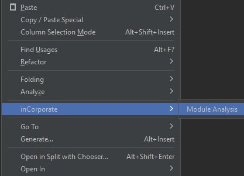
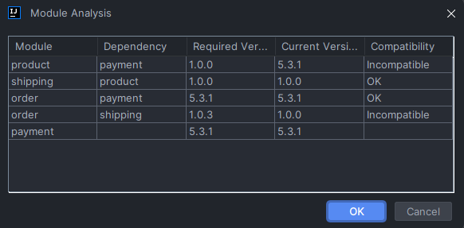

# inCorporate

Analysis of compatibilities among versions of existing modules in your Java/Kotlin project.
 
 
<b>Features:</b>
<ul>
    <li>Module Analysis: Displays the compatibility status of all module versions in a project, including major, minor, and patch versions.</li>
    <li>Supports all JetBrains IDEs, including IntelliJ IDEA, PyCharm, WebStorm, and Android Studio.</li>
</ul>
<h3>Usage</h3>
<ul>
<li>
1. Right-click and go to inCorporate -> Module Analysis 
 

</li>
<li>
2. A new window will appear with the modules imported into your project and their respective dependencies, required versions, and compatibility
 
 

</li>
<li>3. Enjoy!</li>
</ul>

<b>Coming soon:</b>
<ul>
    <li>Change version on the Module Analysis and apply upgrade/downgrade compatibility</li>
    <li>Display historic of tags on the remote repository for each module of project</li>
    <li>Support to the module with Gradle</li>
    <li>Feel free to send any feature suggestions to me :)</li>
</ul>

String url = "https://github.com/Yonatha/ai-code-review.git";
try (Git git = Git.cloneRepository()
.setURI(url)
.setDirectory(Paths.get("/path/to/local/repo").toFile())
.call()) {
Collection<String> remoteUrls = git.getRepository().getConfig().getStringList("remote", "origin", "url");
System.out.println(remoteUrls.iterator().next());
} catch (GitAPIException | IOException e) {
e.printStackTrace();
}

Repository repository = Git.open(new File(module.getPath())).getRepository();
repository.getConfig().getString("remote","origin","url");