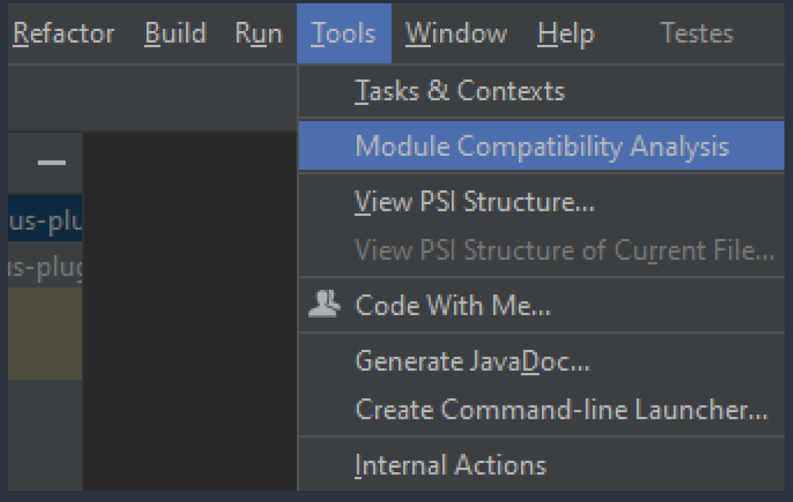

# inCorporate

Analysis of compatibilities among versions of existing modules in your Java/Kotlin project.
 
 
<b>Features:</b>
<ul>
    <li>Module Analysis: Displays the compatibility status of all module versions in a project and switch branches.</li>
    <li>Switch branches</li>
    <li>Support IntelliJ and Android Studio.</li>
</ul>
<h3>Usage</h3>
<ul>
<li>
1. Click on the main Tool -> Module Compatibility Analysis 
 

</li>
<li>
2. A new window will appear with the modules imported into your project and their respective dependencies, required versions, and compatibility
 
 

Switch branch by dependency module

</li>
<li>3. Enjoy!</li>
</ul>

<b>Coming soon:</b>
<ul>
    <li>Change version on the Module Analysis and apply upgrade/downgrade compatibility</li>
    <li>Display historic of tags on the remote repository for each module of project</li>
    <li>Support to the module with Gradle</li>
    <li>Feel free to send any feature suggestions to me :)</li>
</ul>
